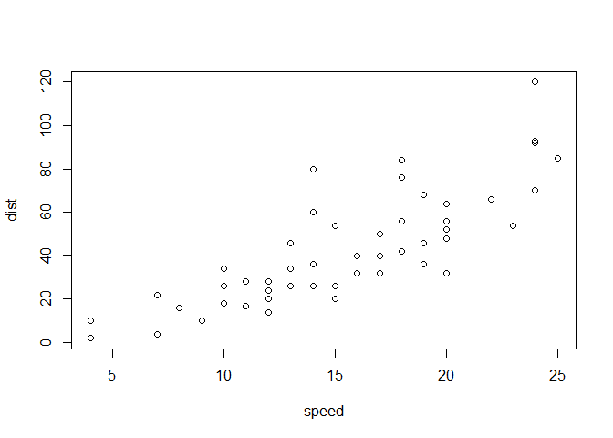

Programming Background
================
Mandy Liesch
9/15/2021

``` r
library(usethis)
```

    ## Warning: package 'usethis' was built under R version 4.1.1

``` r
use_git_config(user.name="Mandy Liesch", user.email="amliesch@ncsu.edu")
```

``` r
#code to create the rendering
rmarkdown::render("_Rmd/2021-9-15-Programming-Blog.Rmd", 
                  output_format = "github_document", 
                  output_dir = "_posts/", 
                  output_options = list(toc=TRUE, toc_depth = 2, html_preview=FALSE))
```

## R vs Other Programming Languages.

So, I have done work both statistically and programmatically in several
different languages, R, SAS, Python, SQL, and many other geospatial
processing softwares. I love R, because it is so flexible, and is free
and open source. Python is also awesome, and great for larger datasets,
but being mostly someone who is statistically oriented, R is the
superior choice. Being able to install ready made packages with
tutorials and example data loaded right in to practice and explore.
Utilizing libraries, like data.table, I can work with huge geospatial
datasets, pulling and manipulating with simple SQL-esque queries.

My achilles heel as a programmer is related to understanding functions.
So softwares that rely more on procedural, action based programming,
like SAS (and FORTRAN or C) tend to be much more difficult for me to
understand. Whereas Both R and Python are object oriented programming,
and they are so much easier to understand, and my brain can wrap itself
around the programming methods in R much easier than others. It was
fairly easy to pick up, even though it was a lot of copy-paste at first.
It allowed me to make mistakes, but I could see them right away in the
frames. I do miss the speed and capacity in Python, but through
packages, I have been able to read and understand, and adapt much easier
in R. The other disadvantage for R has to do with its flexibility. It is
nice not to have a rigid answer, but it also makes it much more
difficult to get the correct solution on stackexchange or other help
websites.

``` r
summary(cars)
```

    ##      speed           dist       
    ##  Min.   : 4.0   Min.   :  2.00  
    ##  1st Qu.:12.0   1st Qu.: 26.00  
    ##  Median :15.0   Median : 36.00  
    ##  Mean   :15.4   Mean   : 42.98  
    ##  3rd Qu.:19.0   3rd Qu.: 56.00  
    ##  Max.   :25.0   Max.   :120.00

## Including Plots

You can also embed plots, for example:

<!-- -->

Note that the `echo = FALSE` parameter was added to the code chunk to
prevent printing of the R code that generated the plot.
